# LAB 2: GPIO and Digital Communication

**OBJECTIVES**
- To better understand and use library functions.
- Configuring GPIO as input and output
- Configuring UART communication.
- Compiling I2C and SPI examples.
- To setup a new blank project.

**EQUIPMENT** 
1.	A laptop that has the Pico C/C++ SDK installed
2.	Raspberry Pico W
3.	Micro-USB Cable
4.	1x Male-Male Jumper wire

> [NOTE]
> Only students wearing fully covered shoes and long pants are allowed in the lab for safety reasons.

## **INTRODUCTION** 

In this lab, we will dive into the **General Purpose Input/Output (GPIO)** capabilities of the Raspberry Pi **Pico W**, which are the foundation for interacting with external components such as LEDs, buttons, and sensors. GPIO pins can be configured as inputs or outputs, allowing the Raspberry Pi Pico W to read data from sensors or control devices like motors and displays. These pins are the backbone of many microcontroller-based projects, enabling developers to create various embedded systems applications.

However, the Pico W's GPIO pins are more than simple input/output points. Each pin on the Pico W is **multiplexed**, meaning it can serve multiple functions—such as **UART, SPI, I2C**, or **PWM**—depending on how the pin is configured in your code. For example, a single pin could be used for UART communication in one project and SPI communication in another. Because of this flexibility, developers must carefully plan and decide which GPIO pins to use for each function before starting their project. Improper pin assignments could lead to conflicts, making certain peripherals unusable or causing unexpected behaviour.

In this lab, we will also explore **Serial Communication**, an essential protocol that enables the efficient transfer of data between two Pico W boards (or other devices) over a wired connection. Specifically, we will focus on the **UART** (Universal Asynchronous Receiver-Transmitter), **I2C**, and **SPI** protocols, each serving different use cases depending on the type of data transfer required. For example, SPI is commonly used for high-speed communication with sensors or displays, while I2C is great for communicating with multiple devices using fewer wires.

In addition to learning about GPIO and serial communication, you'll have the opportunity to create a project from scratch using the **Pico C SDK**. You'll experience hands-on coding, compiling, and deploying a project while gaining insight into the flexibility of the Pico W's architecture.

Through this lab, you’ll enhance your practical skills and develop a deeper understanding of how to plan, configure, and utilize the versatile GPIO and communication features of the Raspberry Pi Pico W.

Let’s begin our journey into embedded systems and serial communication with the Raspberry Pi Pico W!


## **DEFINES and MACROS** 

Preprocessor directives like defines and macros are often used when programming embedded systems to make the code more readable and easier to maintain.  In C programming, #define is a preprocessor directive used to create "macros." While they're often discussed interchangeably, #define is the mechanism, and the macro is the result. Macros can represent values or pieces of code and are a form of text substitution done __before compilation__. They're not true functions or variables, so they don't have types or memory allocations. Though they can make code more efficient, they might also introduce complexity or errors if not used cautiously.

```
#define PI 3.14159
#define MIN(a, b) ((a) < (b) ? (a) : (b))
```
In the above example, PI is a simple macro representing the value 3.14159, and MIN is a macro that computes the minimum of two values.

## **GPIO - INPUT** 

We will be building the [blink](https://github.com/raspberrypi/pico-examples/blob/master/pico_w/wifi/blink/picow_blink.c) sample code for the Pico W. This time, we have a better understanding of GPIO and what we need to do to configure an LED. Unfortunately, the user cannot use the button on the Pico W (its for boot select only). Now that we are using the Pico W together with the Maker board, we have access to three buttons. In this example, we will demonstrate how to use a button connected to GP20. These buttons are connected via a pull-up circuit, so they need to be configured accordingly.

The modified code, [picow_blink_button](picow_blink_button.c), configures GP20 as an input with a pull-up resistor. When the button connected to GP20 is not pressed, the pin remains in a high state. Pressing the GP20 button will pull the pin low, causing the LED to stop blinking (as defined in the code). Releasing the button returns the pin to a high state, allowing the LED to resume blinking.

However, if the button circuitry is supposed to be active-high, then the GPIO pin must be configured to a pull-down mode.

> [!NOTE]
> Notice that the code calls `gpio_init(BTN_PIN)` before setting the direction and the pulls. Try deleting that line: the program still works. It works because the RP2040 happens to reset the pad's input-enable bit to 1, and because `gpio_set_pulls()` writes the pad register whether or not the pin has been claimed by SIO. **Relying on reset defaults is how you write code that works on your board and fails on the next revision of the hardware.** Initialise every pin you use, every time — this is the first of several habits in this module that cost one line and save one evening.

The images below illustrate how a pull-up configuration would be used as a GP20 button on the Pico W.

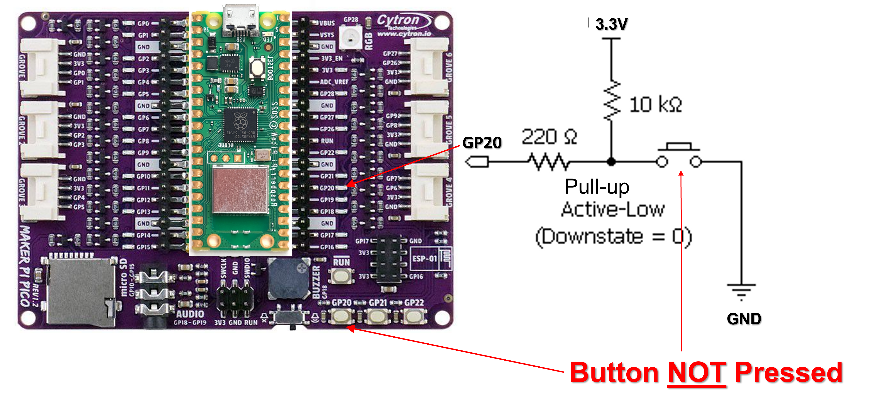

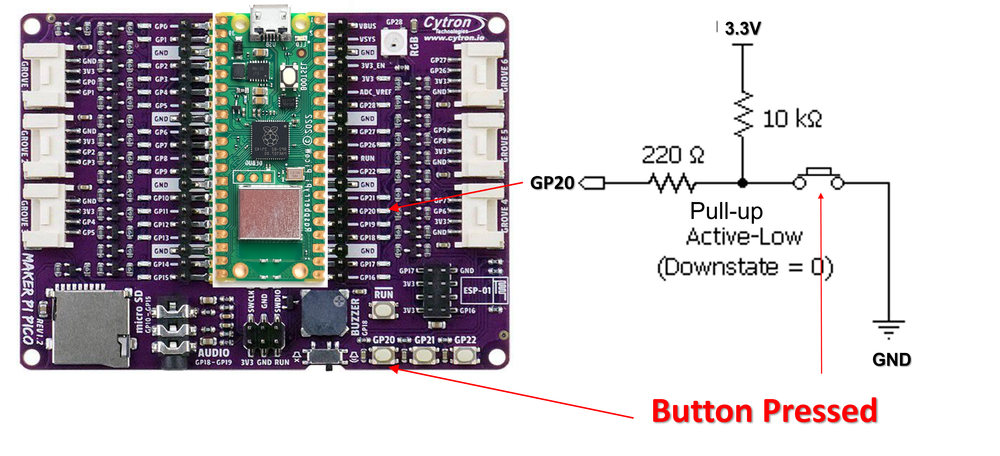

## **GPIO - OUTPUT** 

This [code](pulse.c) demonstrates generating a custom signal on a GPIO pin. `GP15` is driven high for 1 second (a "high" signal) and low for 2 seconds (a "low" signal), repeating forever. Various pulse shapes can be generated this way by changing the two delays.

**Wiring:** `GP15` → 330 Ω resistor → LED anode; LED cathode → `GND`. The same LED you wired in Lab 1.

> [!IMPORTANT]
> This example drives a **real GPIO pin**, not the on-board LED. On the Pico W the on-board LED is connected to the WiFi chip, so `cyw43_arch_gpio_put()` is an SPI transaction to the CYW43 — it takes microseconds, not nanoseconds, and its timing is not GPIO timing. You cannot put a scope probe on it either. If you want to *see* the signal you have just described, it has to come out of a pin. Put a probe on GP15 and confirm the 1 s / 2 s pulse train is really there.

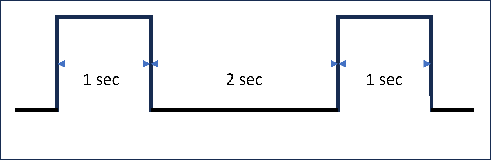


## **SERIAL COMMUNICATIONS - UART**

In this task, you will work in pairs. **Pico A** will compile and run the sample code for [hello_uart](https://github.com/raspberrypi/pico-examples/blob/master/uart/hello_uart/hello_uart.c), which will send character data via the serial pins (instead of the USB cable). While **Pico B** will compile and run [uart_rx](uart_rx.c) using a new project (see next section on how to create a new project).

To successfully exchange data between the two Pico W boards, it is essential to connect **Pico A**'s GP0 (TX) to **Pico B**'s GP1 (RX), and vice-versa. Here's why:
- Connecting GP0 of **Pico A** to GP1 of **Pico B**: GP0 on Pico A is configured as the transmit pin (TX), which sends data. GP1 on **Pico B** is configured as the receive pin (RX), which listens for incoming data. **Pico A** can send data that **Pico B** will receive by connecting them. Additionally, you should connect **Pico B**'s GP0 (TX) to **Pico A**'s GP1 (RX), allowing data transmission in both directions (if needed).
Ground (GND) connection: Both Pico W boards must share a common ground (**GND**) to establish a reliable electrical connection. Without connecting the GNDs of both boards, the voltage levels may be inconsistent, potentially causing communication issues or data corruption. By linking the grounds, you ensure both boards have the same reference point for voltage, enabling stable and correct data transmission.

Please ensure that **Pico A** includes a while-loop so the sender continuously transmits characters to **Pico B**. The image below illustrates the correct wiring setup for connecting the two Pico W boards via UART, showing the TX and RX cables swapped between the boards.
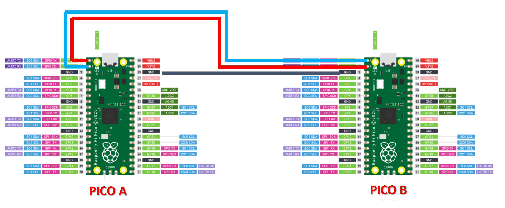

> [NOTE]: The key difference between `hello_usb` and `hello_uart` in the Pico examples is that `hello_usb` sends output through the USB interface, displaying messages on the connected computer's terminal, while `hello_uart` transmits data via the UART pins (TX/RX), allowing communication with other devices over a serial connection.

> [NOTE]:  Guide on how to connect, compile and execute the examples for I2C and SPI can be found [here](digcomms.md).

## **Creating your own Project (in VSC)** 

Creating your own project folder in VSCode helps keep your code organized and makes it easier to manage multiple files, especially in larger projects. By having a dedicated folder for each project, you can neatly separate different sets of code, configurations, and resources, preventing clutter. This makes it easier to navigate your project, track changes, and share it with others. Additionally, VSCode uses this structure to recognize your project environment, allowing it to handle tasks like compiling, debugging, and version control more effectively. It also keeps your workspace clean and ensures that your projects don’t interfere with each other.

Go ahead and create a directory to house your new project. As in the previous task, we compiled a pico example project called [hello_uart](https://github.com/raspberrypi/pico-examples/blob/master/uart/hello_uart/hello_uart.c) that will send three characters (one at a time) via the UART_TX located on GP0 on the Raspberry Pi Pico.  In this task, we shall create a folder (under Explorer) within the UART as shown below.

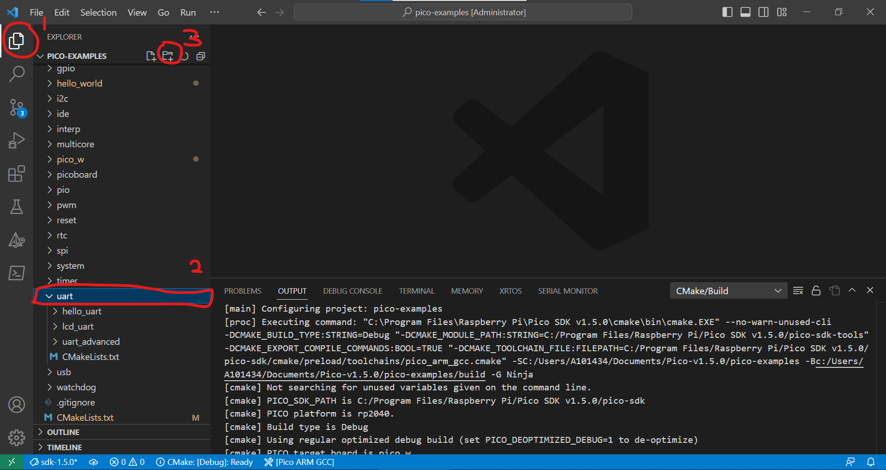

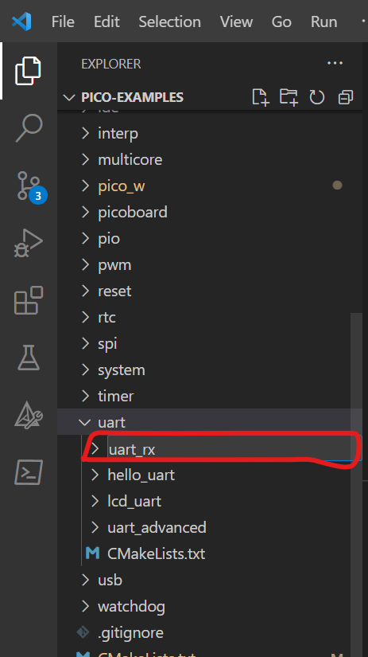

Add a C file with the name uart_rx.c

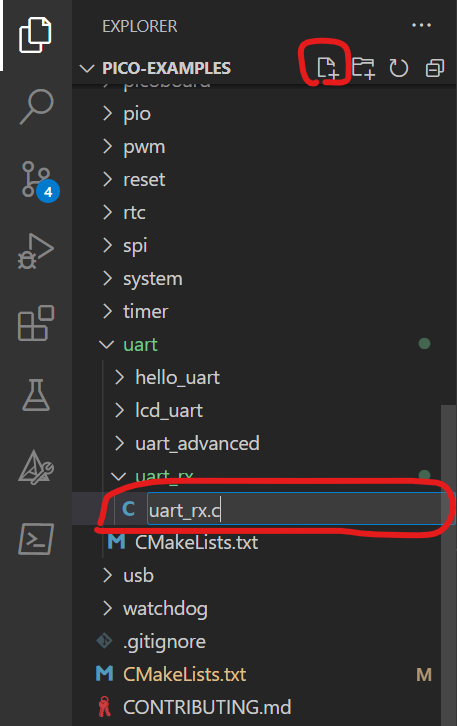

Add a text file with the name ["CMakeLists.txt"](CMakeLists.txt). Ensure the filename is correct. A mistake here will lead to errors.

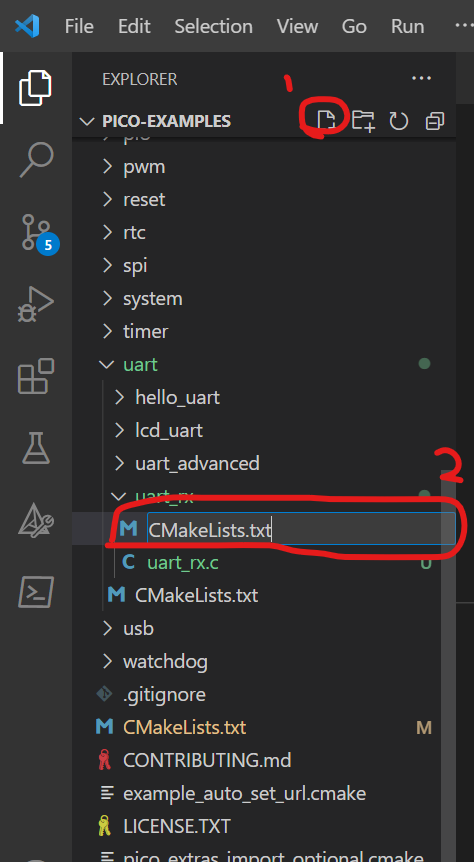

Go to uart's folder CMakeLists.txt (see below) and include the "add_subdirectory(uart_rx)" into the file in line #5.

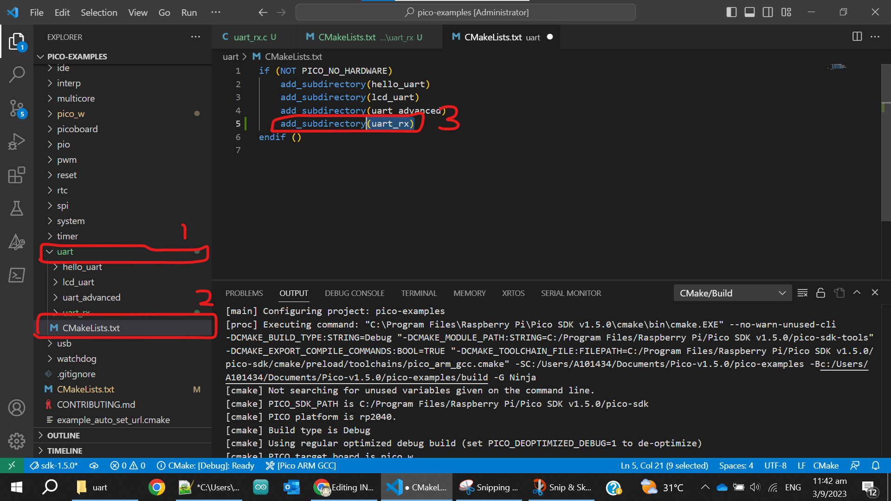

Once you have saved this CMakeList.txt file, it will configure the project and create the build folder.

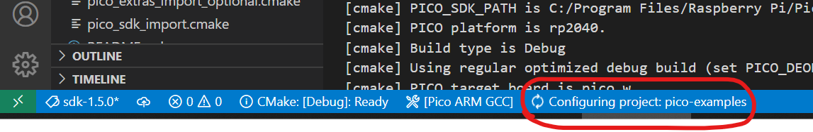

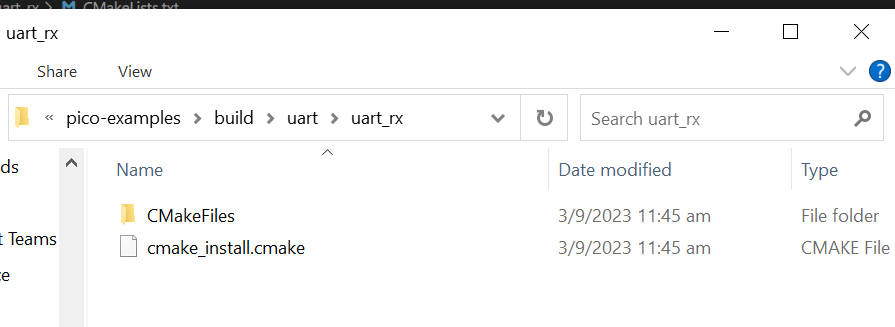

Now, you can go to CMake tool and build your new project.
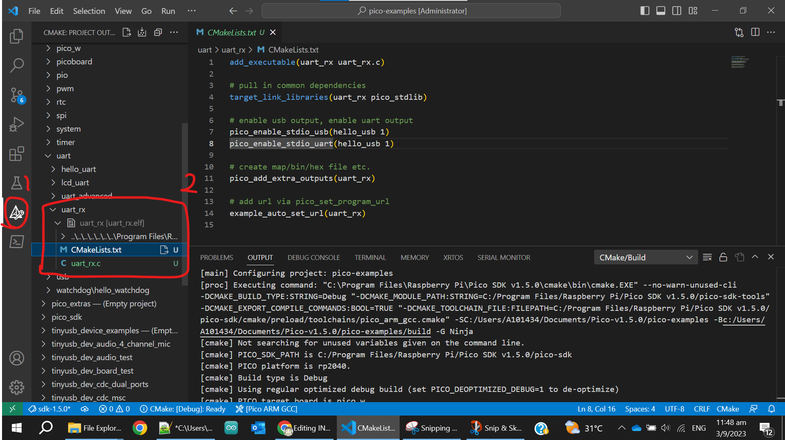
> [NOTE]: There is an error in the screenshot above. Do use the correct [CMakeLists.txt](CMakeLists.txt) file in the repository.
## **EXERCISE**

The application uses UART communication via GPIO pins GP8 (TX) and GP9 (RX) on UART1 for data transmission and reception. It also includes conditional logic based on the state of button GP22. The functionality can be explained as follows:
- When button GP22 is **not pressed**: The software sends the numeric value '1' through UART1 every 1 second.
- When button GP22 is **pressed**: The software transmits uppercase English alphabet characters sequentially, starting from 'A' to 'Z', with a 1-second delay between each character. After reaching 'Z', it loops back to 'A'. For example, if GP22 is pressed, the output would be 'A', then 'B', and so on, with a new letter sent every 1 second.

For data reception, the software utilizes the UART1 receiver. When it reads incoming data (see Note #1):
- If the data is an uppercase alphabet character (e.g., 'A', 'B'), the software converts it to the corresponding lowercase character (e.g., 'a', 'b'). The transformed character is then printed to the serial terminal.
- If the received data is '1', the software will print the number '2' instead.
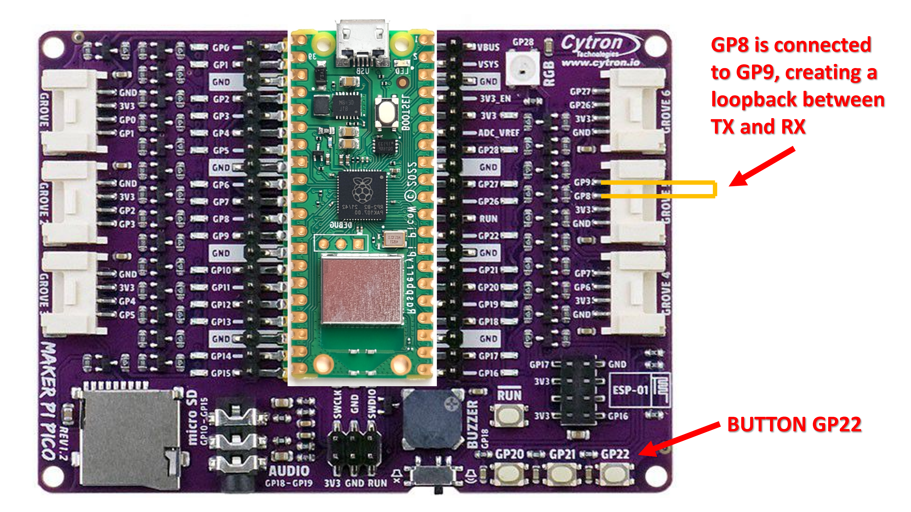

 > [NOTE 1]: By connecting GP8 to GP9, we effectively create a UART loopback, meaning the transmitted data from the TX pin (GP8) is immediately received by the RX pin (GP9). This allows the Pico to both send and receive data in a self-contained loop, which is useful for testing and debugging the UART functionality.

 > [NOTE 2]: Some groups will see occasional strange behaviour in this exercise — characters that go missing, or arrive as something other than what was sent. Others, running the same code on the same hardware, will see nothing wrong at all. Before you start re-seating jumper wires: **the wiring is not the problem.**

## **A Deliberate Intermittent Fault**

There is a fault in the setup you have just built. It is not a typo and it is not a mistake in your wiring. It is a design decision inherited from the sample code, and it is the kind of fault that reaches customers — because it passes testing on the bench and fails in the field.

The symptom is **data loss**, not corruption. Nothing reports an error. Nothing crashes. Characters simply do not arrive, and how often that happens depends on how fast the sender transmits and on which laptop you are using. Two groups running identical code will get different results, which is exactly why this class of fault is so expensive to find late.

**Your first job is to make it happen on demand.** An intermittent fault is not debuggable; a reproducible one is ordinary work. Take the transmitting board and change nothing except the rate at which it sends. Send one character per second, then ten, then as fast as the loop will go, and record what the receiver prints at each rate. Somewhere in that range the behaviour changes. Find that boundary before you form any theory — **a fault with a boundary is a fault with an explanation.**

**Your second job is to explain the mechanism.** Not "it drops characters" — that is the symptom you started with. Say precisely what the receiver is doing at the moment a character is lost, why it cannot attend to the incoming data during that time, and what hardware is supposed to be covering the gap. Work out how much time that hardware actually buys you, in microseconds, at 115200 baud. The Raspberry Pi Pico C/C++ SDK documentation and the RP2040 datasheet's UART chapter have everything you need.

**Your third job is to propose fixes — plural.** There are at least five ways to address this, and they are genuinely different in character rather than being the same fix written five ways. Some remove the conflict, some increase the margin, some only make the fault rarer, and at least one does nothing about the loss but ensures you are told when it happens. For each fix you propose, state: 
- what it costs (pins, memory, CPU time, complexity),
- whether it eliminates the fault or merely reduces its probability,
- and whether it would still hold if the data rate were increased tenfold.

That last question is the one that separates a fix from a workaround. A change that makes a fault rarer has not fixed it — it has made it someone else's problem, six months from now, on a system nobody remembers building. 

> Use the method in [BUGHUNT.md](../BUGHUNT.md), and record your reasoning as you
> go. You will meet this same fault again, in a harder form, in Bug Hunt #5.


## Challenge: The command that arrives as text

Bug Hunt #2 below puts a sensor reading on the wire as **bytes**. This challenge
puts commands on the same wire as **text** — `SET LED 2 ON\r\n` — and asks you to
parse them on a microcontroller with no operating system underneath you.

Modems take AT commands, GPS receivers emit NMEA sentences, test equipment
speaks SCPI. All of them are lines of ASCII arriving one character at a time
from a sender who may be badly behaved. Writing a parser that survives that is
ordinary embedded work, and it is the one skill this module has so far only
asked you to do a single character at a time.

Three rules, and they are what make this an embedded exercise rather than a
first-year C exercise: **no `malloc`**, **no `strtok()`**, and **tokenise in
place** — write NULs over the separators in the caller's buffer and hand back
pointers into it. A host test harness with sixty-odd golden vectors is provided,
so you can get it right on your laptop in seconds rather than on hardware in
hours.

> **Start here:** [`cmdparse/`](cmdparse/)

## Challenge Yourself: Bitwise LED Challenge on Pico

Problem:
You have 4 LEDs connected to GPIO pins 2–5 on the Raspberry Pi Pico. Treat these LEDs as the 4 bits of a binary number. Start with the value 0001 (only the rightmost LED is ON).

Button A: Each press shifts the LED pattern left (<<) so the next LED lights up. When it reaches the last LED, wrap around to the first.

Button B: Each press toggles (^) the rightmost LED ON/OFF without affecting the others.

Use bitwise operators (|, &, ^, ~, <<, >>) to update and display the LED states.

---

## **BUG HUNT #2 — The frame that arrives wrong**

The second [Bug Hunt](../BUGHUNT.md). This week's algorithm is **serialisation
and framing**: flattening a sensor reading into bytes, pushing it down UART1 to
your partner's Pico, and rebuilding it on the far side. Same wiring as the paired
UART task above — the payload is now a struct rather than a character.

**Seven defects** are planted. Five are in the codec and your laptop will find
them in one second; the other two exist only on a real UART link between two
boards.

This is the first hunt where **the defect is not where the symptom is**. The
receiver prints nonsense, and most of the causes are in the transmitter. The
technique that cracks it — hex-dump at both ends and diff the bytes — is the one
you will use for every wire protocol you ever touch.

Guidance steps down from Hunt #1: you still get a worked technique, but the hints
are now grouped by *area*, and there are fewer hints than there are defects.

> **Start here:** [`bughunt/`](bughunt/) · **Method:** [`../BUGHUNT.md`](../BUGHUNT.md)
