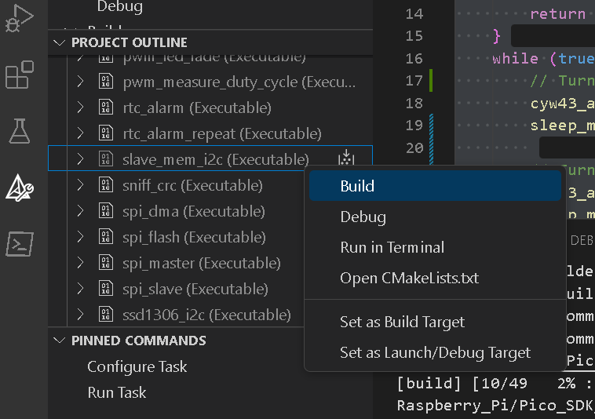

### I2C and SPI Communication on Raspberry Pi Pico W [optional]

#### Overview
I2C (Inter-Integrated Circuit) and SPI (Serial Peripheral Interface) are synchronous communication protocols commonly used in embedded systems for short-distance data transfer between a microcontroller and peripheral devices. I2C operates with two lines, SDA (Serial Data Line) and SCL (Serial Clock Line), allowing multiple devices to communicate on a shared bus through addressing. SPI, on the other hand, uses four lines: MOSI (Master Out Slave In), MISO (Master In Slave Out), SCLK (Serial Clock), and SS (Slave Select), allowing faster, full-duplex communication between a master and multiple slaves. 

UART (Universal Asynchronous Receiver Transmitter) differs from I2C and SPI by being asynchronous, meaning it doesn’t use a clock line for data synchronization. Instead, UART relies on start and stop bits for communication, and both devices must agree on a baud rate. UART typically uses two lines, TX (Transmit) and RX (Receive), for data transmission between two devices. 

The key differences between these protocols include clocking, speed, and the number of wires used. I2C and SPI are clocked (synchronous), while UART is asynchronous. SPI is generally faster than I2C and UART, with more wires involved (four compared to I2C's two and UART's two). Furthermore, I2C supports multiple masters and slaves on a single bus, SPI works with one master and multiple slaves, while UART is designed for point-to-point communication. Each protocol is suited to different applications, and loopback tests are useful for verifying that the respective communication setups are working properly.


---

### **Part 1: I2C Communication Setup**

#### 1.1. **Objective**
This task demonstrates I2C communication using **one** Pico W board.

The RP2040 has **two independent I2C controllers**, `i2c0` and `i2c1`. The
`slave_mem_i2c` example configures `i2c0` as an I2C **slave** and `i2c1` as an
I2C **master**, on different pins of the same chip, and then wires them to each
other. The master writes into the slave's memory, reads it back, and prints the
result — a **loopback test**, in exactly the same spirit as the UART loopback in
the main lab.

> [!NOTE]
> You do **not** need a partner or a second board for this part. If you were
> expecting two boards talking to each other, read the objective again — the
> two things talking are two peripherals inside one RP2040. Part 2 (SPI) does
> use two boards.

#### 1.2. **Materials**
- **1** Raspberry Pi Pico W board
- Breadboard and 2 jumper wires
- Computer with VS Code and Pico SDK installed
- USB cable

#### 1.3 **I2C Wiring Table**

Two wires, both on the **same board**:

| **From — `i2c1` (master)** | **To — `i2c0` (slave)** | **Signal** |
|----------------------------|-------------------------|------------|
| GP6                        | GP4                     | SDA        |
| GP7                        | GP5                     | SCL        |

No ground wire is required: both controllers are on the same chip and already
share a ground.

> [!NOTE]
> **Where are the pull-up resistors?** I2C is an open-drain bus — devices can
> only pull a line *low*, so something must pull it back *high*, and with no
> pull-up neither line ever rises and nothing works. Normally you fit two
> external resistors. Here the example calls `gpio_pull_up()` on all four pins
> and uses the RP2040's internal pull-ups instead. Those are weak (roughly
> 50 kΩ against the 2.2–10 kΩ you would normally fit), which is fine for two
> pins an inch apart at 100 kHz and **not** fine for a longer bus or a faster
> one. Worth knowing before you wonder why a real sensor will not respond.

#### 1.4. **Steps**

1. **Set up the environment**:
   Make sure that the Pico SDK and `pico-examples` are properly set up on your machine. 
2. **Compiling the code**:
   Select the I2C 'slave_mem_i2c' code provided in the example folder and build it (as shown below).
   


3. **Upload the code**: Upload the .UF2 file onto the Pico W.
4. **Run the code**:
   Once the code is uploaded, the Pico W's two I2C modules will communicate over the two wires you fitted. The master will write data to the slave's memory, read from it, and print the results on the serial terminal.

#### 1.5. **Expected Observations**

- **Data Transmission**: 
  - The master controller (`i2c1`) sends a message to the slave controller (`i2c0`), starting from a specific memory address. The address is incremented after each transmission.
  
- **Data Reception**:
  - The slave stores the message in its memory and returns it when read. The master reads the data back sequentially — note that it comes back in **two** reads, which is what the split output below shows.

- **Terminal Output**: 
  - The serial terminal will display the sent and received messages. You should observe the following format:
  
    ```
    Write at 0xXX: 'Hello, I2C slave! - 0xXX'
    Read  at 0xXX: 'Hello, '
    Read  at 0xXX: 'I2C slave! - 0xXX'
    ```

> [NOTE]: You will need to edit the CMakeLists.txt file to enable the serial over the USB cable (refer to Lab 2 - Serial Communications UART).

---

### Part 2: SPI Communication

#### 2.1. Objective
In this section, we will use the SPI protocol to establish communication between two Raspberry Pi Pico boards, where one Pico acts as the SPI master and the other as the SPI slave.

#### 2.2. Materials
- 2 Raspberry Pi Pico W boards
- Breadboard and jumper wires
- Computer with VS Code and Pico SDK installed
- USB cables

#### 2.3. Wiring Diagram

Both examples use the default `spi0` pins, which on the Pico W are:

| Pin | SDK name | Function |
|---|---|---|
| GP16 | `PICO_DEFAULT_SPI_RX_PIN` | RX — data **in** |
| GP17 | `PICO_DEFAULT_SPI_CSN_PIN` | CSn — chip select |
| GP18 | `PICO_DEFAULT_SPI_SCK_PIN` | SCK — clock |
| GP19 | `PICO_DEFAULT_SPI_TX_PIN` | TX — data **out** |

**Read that table before you wire anything.** The pin numbers are the same on
both boards, but the *direction* is not, and this is where SPI catches people
out. `GP19` is TX on **both** boards — so it cannot connect to `GP19` on the
other one, because that would be two outputs shorted together. The master's TX
must go to the slave's **RX**, and vice versa.

### SPI Communication Wiring (Pico A to Pico B)

| **Signal** | **Pico A (Master)** | **Pico B (Slave)** | **Direction** |
|------------|---------------------|--------------------|---------------|
| SCK        | GP18 (SCK)          | GP18 (SCK)         | A → B         |
| MOSI       | GP19 (TX)           | **GP16 (RX)**      | A → B         |
| MISO       | **GP16 (RX)**       | GP19 (TX)          | B → A         |
| CS         | GP17 (CSn)          | GP17 (CSn)         | A → B         |
| GND        | GND                 | GND                | common        |

**Five wires, not three.** SPI is full duplex: every clock pulse shifts one bit
out on MOSI *and* one bit in on MISO, simultaneously. Omit the MISO wire and the
master transmits perfectly and reads all zeroes — which is exactly the symptom
the example's own documentation warns about, and which looks far more like a
software bug than a missing wire.

> [!NOTE]
> **MOSI and MISO are role names; TX and RX are pin names.** The RP2040
> datasheet and the SDK label the pins by direction relative to *the peripheral*
> — `GP19` is always TX and `GP16` is always RX, whichever mode you put the SPI
> block into. MOSI/MISO describe the *link*. On the master, TX is MOSI; on the
> slave, TX is MISO. Keeping the two vocabularies apart is most of what makes
> SPI wiring diagrams confusing, and it is why the table above has a Direction
> column.


#### 2.4. Steps

1. **Compile the SPI example**:
   Navigate to the `pico_examples/spi/` directory. The examples we will use are 'spi_master' and 'spi_slave' under `spi_master_slave`.
2. **Upload the code**:
   - Flash the `spi_master` example to **Pico A** (Master).
   - Flash the `spi_slave` example to **Pico B** (Slave).

3. **Run the SPI communication**:
   Once the code is uploaded, the two boards should start exchanging data using the SPI protocol. If the master reports reading all zeroes, check the MISO wire before you check anything else.

#### 2.5. Expected Observations
- The master Pico will send data (e.g., a sequence of bytes) to the slave Pico.
- The slave Pico will receive the data and may respond with its own data.
- Using a serial terminal, you can monitor the data exchange and confirm successful SPI communication.

---

### Conclusion

In this lab, we implemented and demonstrated I2C and SPI communication on the Raspberry Pi Pico W. For I2C we used the RP2040's **two on-chip controllers on a single board** — `i2c1` as master, `i2c0` as slave — where the master initiated data transfers and the slave responded accordingly. That loopback is a technique worth keeping: it lets you prove a protocol implementation works before a second device, or a partner, is involved at all.

For SPI we used **two boards**, one configured as master and one as slave. This showcased the full-duplex nature of SPI, where both devices exchange data simultaneously over separate MOSI and MISO lines — which is why that link needs four signal wires where I2C needed two. The faster speed and direct data lines of SPI make it ideal for high-throughput applications, as seen in this test scenario.

Overall, this lab demonstrated the practical differences between I2C and SPI, highlighting the strengths of each protocol for different embedded system applications. These exercises helped reinforce key concepts such as synchronous communication, pin configuration, and data exchange mechanisms, providing a solid foundation for future projects involving these protocols.
