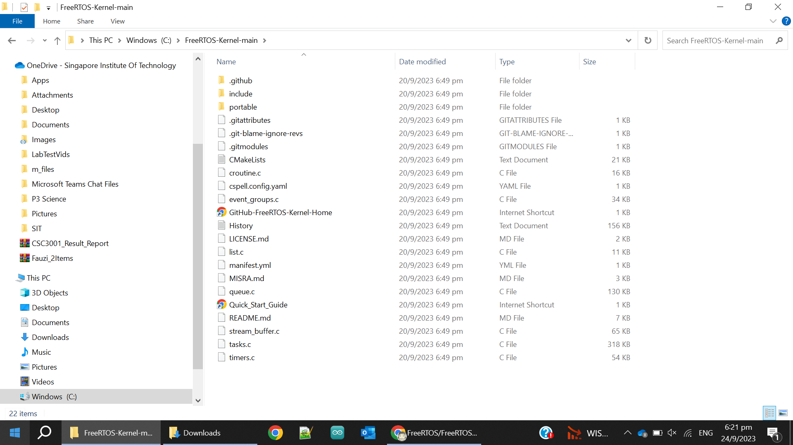
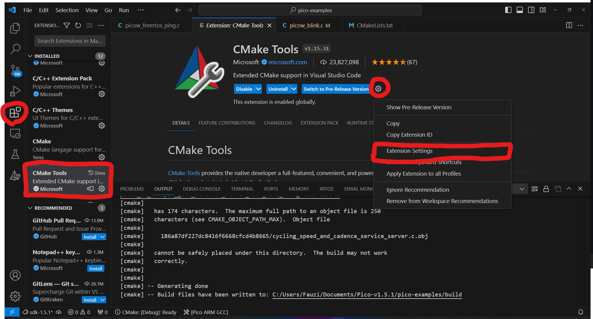
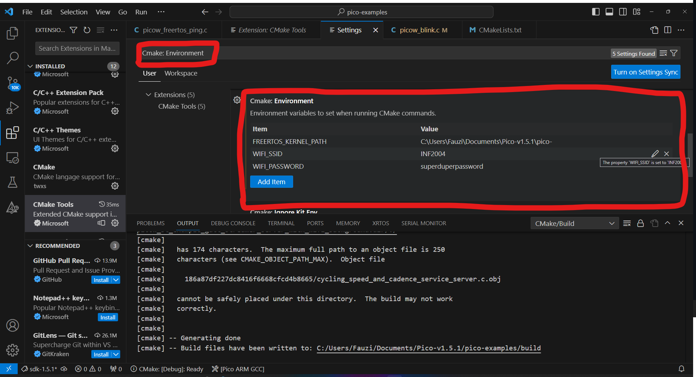
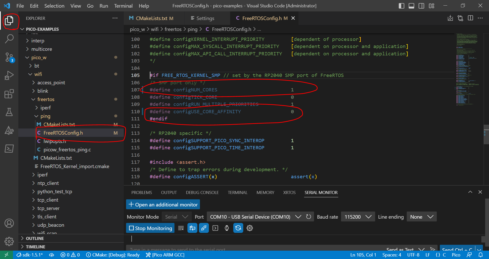
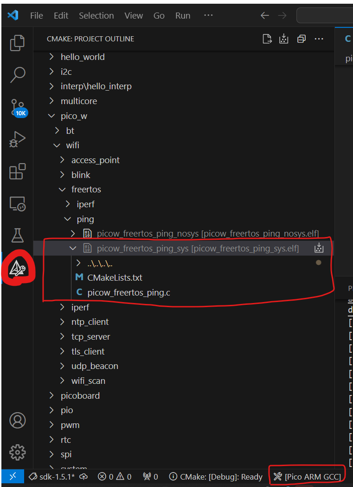
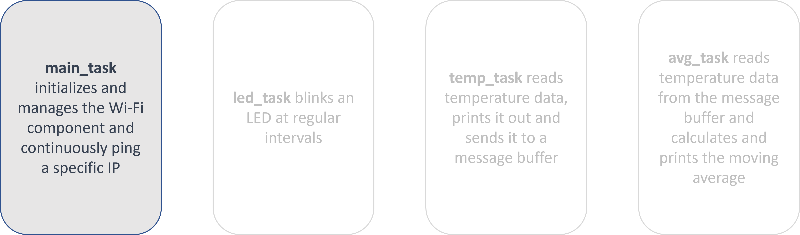
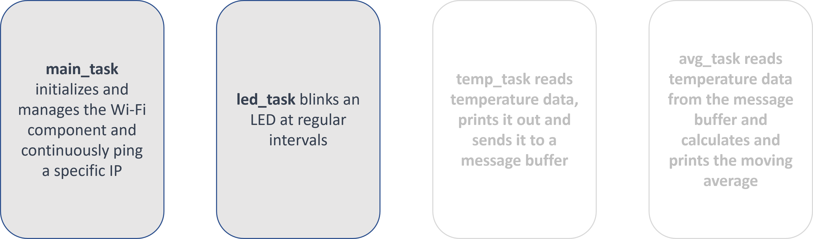
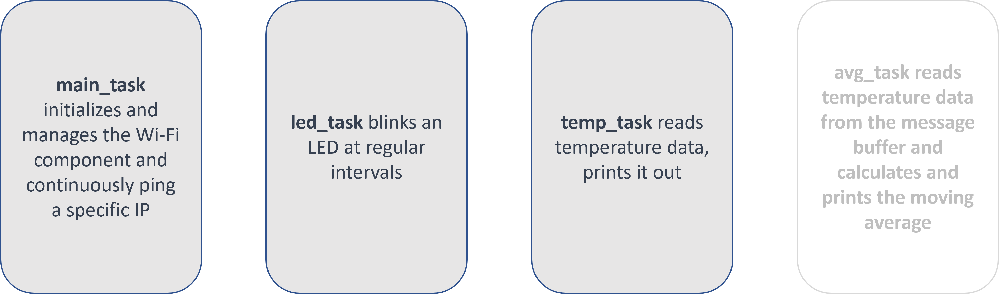
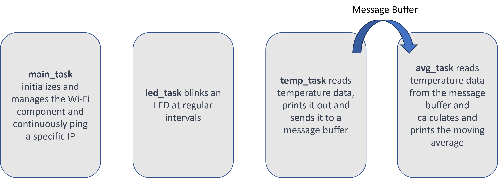

# LAB 5: FreeRTOS & Real-Time Concepts

**OBJECTIVES**
- Configure and implement FreeRTOS on RPi Pico.
- Explain the **task states** and the **priority-based preemptive scheduler**.
- Create tasks, and make them **periodic** without accumulating drift.
- Pass data between tasks with **message buffers** and **queues**, and choose correctly between them.
- Protect a shared resource with a **mutex**, and explain **priority inversion**.
- Move work out of an ISR and into a task using **deferred interrupt handling**.
- Implement a filtering algorithm for processing sensor data.

**EQUIPMENT**
1.	A laptop that has the Pico C/C++ SDK installed
2.	Raspberry Pico W
3.	Micro-USB Cable
4.	One push button (for the interrupt section) — the **GP21** button from LAB 3

> [NOTE]
> Only students wearing fully covered shoes are allowed in the SR6A lab due to safety.

## **INTRODUCTION**

Real-Time Operating Systems (RTOS) are operating systems designed to meet the requirements of real-time systems, which need to process inputs and produce outputs within a **known, bounded time**. Note what that definition does *not* say. It does not say "fast". A system that responds in 10 ms every single time is real-time; a system that usually responds in 1 ms but occasionally takes 50 ms is not. The guarantee is the product, not the speed.

FreeRTOS is a popular open-source RTOS that offers straightforward functionality to enable easy, robust, and optimizable design in embedded systems like the Raspberry Pi Pico. It provides task management to schedule work, and a set of primitives — queues, message buffers, semaphores, mutexes — for tasks to communicate and synchronise with each other.

In this lab we implement FreeRTOS on the Raspberry Pi Pico, build up a four-task sensor pipeline, and along the way name the concepts that make it an *operating system* rather than a fancy `while(1)` loop.

> [NOTE]
> Everything in this lab except the setup section is **portable knowledge**. Task states, priority preemption, mutual exclusion and priority inversion appear in every RTOS you will ever meet — Zephyr, ThreadX, μT-Kernel, VxWorks. Only the function names change.

## **SETTING UP FREERTOS ON RPi PICO**

When integrating FreeRTOS with a project, such as in the case of developing applications for the Raspberry Pi Pico, it is essential to configure the build system correctly, to compile the application code together with the FreeRTOS kernel code. CMake is a widely used build system that can be configured to build your project and the FreeRTOS kernel together. This involves including the FreeRTOS source files and setting the necessary environment settings.

We will be using the [Ping example that uses FreeRTOS](https://github.com/raspberrypi/pico-examples/blob/master/pico_w/wifi/freertos/ping/picow_freertos_ping.c). However, we will need to take a few steps to enable it. Currently, you should **only be able to see** it in Explorer and **not be able to see** it in CMake. To set up FreeRTOS on Raspberry Pi Pico, download the [FreeRTOS Kernel](https://github.com/FreeRTOS/FreeRTOS-Kernel) and unzip it onto your computer. Do take note of where the folder is located.

> [NOTE]
> Please note that there seems to be an issue with this example in version Pico-v1.5.0. Therefore, we will be using Pico-v1.5.1. Windows users can just reinstall the SDK and it will create a new folder, or you may do a git pull.



Then add three items into the CMake: Environment
- FREERTOS_KERNEL_PATH: C:\FreeRTOS-Kernel-main
- WIFI_SSID: "your mobile hotspot SSID" (SIT's WiFi would not work)
- WIFI_PASSWORD: "superduperpassword"

> [NOTE]: Please use your own hotspot for the WIFI_SSID and WIFI_PASSWORD, as SIT's WiFi security doesn't work well with Pico.

There are various methods to do it, but in this example, we will include the path into the CMake environment, not the Windows environment. The images below guide you on how you can include the three items.



Next, include `pico_enable_stdio_usb(picow_freertos_ping_sys 1)` into the CMakeLists.txt file for "picow_freertos_ping_sys" to allow serial monitoring via USB.
Do remember to re-select the "Pico ARM GCC" compiler to kick-start the configuration process.



Finally, before you can start compiling your code, make the following changes (lines #107 & #110) to the FreeRTOS configuration. The configuration file is located at "pico_w\wifi\freertos\ping\FreeRTOSConfig.h". This disables SMP and ensures that there will only be a single core used in this example.

```
#if FREE_RTOS_KERNEL_SMP // set by the RP2040 SMP port of FreeRTOS
/* SMP port only */
#define configNUM_CORES                         1
#define configTICK_CORE                         0
#define configRUN_MULTIPLE_PRIORITIES           1
#define configUSE_CORE_AFFINITY                 0
#endif
```

> [NOTE]
> **Why are we switching this off?** Symmetric Multiprocessing (SMP) lets one instance of the FreeRTOS kernel schedule tasks across multiple identical cores — and the RP2040 has two. With SMP enabled, two of your tasks can genuinely run *at the same instant*, on different cores. That is a much harder thing to reason about: every race condition in this lab becomes real rather than theoretical, and "the higher-priority task always runs first" stops being true. We pin everything to one core so that the scheduler behaves the way the diagrams in this lab describe it. **Turning SMP back on is the last extension exercise, and it is not a formality.**

At this point, if everything is done correctly, you should be able to see the project under CMake.


You should try building the project and downloading the code to the RPi Pico. You should be able to see some output on the Serial Monitor.



---

## **PART 1 — TASKS AND THE SCHEDULER**

### **Create a Blinking LED Task**

Currently, we are operating a single task that directs its focus on pinging a specified IP address. Nonetheless, given that we are utilising a Real-Time Operating System, our system is inherently designed to execute multiple tasks concurrently. Consequently, our subsequent task will logically involve constructing an additional task — one designated to manage the blinking of an LED.



Include the following header files to allow printf and to use the GPIO for the LED.
```c
#include <stdio.h>
#include "hardware/gpio.h"
```

The following is the function for blinking the LED. Notice that each task is a forever loop — a task function must **never** return.
```c
void led_task(__unused void *params) {
    while(true) {
        vTaskDelay(pdMS_TO_TICKS(2000));
        cyw43_arch_gpio_put(CYW43_WL_GPIO_LED_PIN, 1);
        vTaskDelay(pdMS_TO_TICKS(2000));
        cyw43_arch_gpio_put(CYW43_WL_GPIO_LED_PIN, 0);
    }
}
```

Include the following in the `vLaunch` function. This will create the instance of the task for execution. `TaskHandle_t` is used for managing the task afterwards — deleting it, changing its priority, notifying it.
```c
    TaskHandle_t ledtask;
    xTaskCreate(led_task, "TestLedThread", configMINIMAL_STACK_SIZE, NULL, 5, &ledtask);
```

> [NOTE]
> **`vTaskDelay(2000)` is not two seconds.** `vTaskDelay()` takes a count in **ticks**, not milliseconds. It is two seconds here only because `configTICK_RATE_HZ` happens to be 1000. Change the tick rate and every delay in your program silently changes with it. Always write `pdMS_TO_TICKS(2000)`, which converts at compile time and is correct at any tick rate. **Bug Hunt #5 plants this exact defect**, and you will not enjoy finding it.

Build and download the project to the RPi Pico. You should now see the ping message appearing on the serial monitor **AND** the LED blinking as intended.

### **What just happened: task states**

You now have two tasks running "at the same time" on one CPU core. They are not, of course — the CPU executes one instruction stream. The kernel switches between them so quickly that they *appear* concurrent. Understanding **when** it switches is the whole of this lab.

At any instant, every task in a FreeRTOS system is in exactly one of four states:

```
                       task is chosen
                       by the scheduler
          +---------+ ---------------> +---------+
          |  READY  |                  | RUNNING |
          +---------+ <--------------- +---------+
             ^   ^      preempted by a    |    |
             |   |      higher-priority   |    |
             |   |      task, or          |    |
             |   |      time-sliced       |    |
             |   |                        |    |
             |   |  event occurs, or      |    | vTaskDelay(),
             |   |  timeout expires       |    | xQueueReceive(),
             |   +------------------------+    | xSemaphoreTake(), ...
             |            +---------+          |
             |            | BLOCKED | <--------+
             |            +---------+
             |  vTaskResume()              vTaskSuspend()
             |            +-----------+
             +----------- | SUSPENDED | <-------------
                          +-----------+
```

- **Running** — actually executing. On a single core, exactly one task is Running.
- **Ready** — able to run, but a task of equal or higher priority currently is.
- **Blocked** — waiting for something: a delay to expire, data to arrive in a queue, a semaphore to be given. **A Blocked task consumes no CPU time at all.**
- **Suspended** — removed from scheduling entirely until someone calls `vTaskResume()`. Rarely needed.

The distinction that matters most is **Blocked versus busy-waiting**. Compare:

```c
    sleep_ms(2000);                  // busy-wait: the task stays READY/RUNNING,
                                     // burns 2 seconds of CPU, blocks everything
                                     // of equal or lower priority

    vTaskDelay(pdMS_TO_TICKS(2000)); // the task goes BLOCKED, the scheduler runs
                                     // something else for 2 seconds
```

Both make *this* task wait two seconds. Only the second one lets the other three tasks get any work done. Every RTOS call that waits for something puts the caller into Blocked — that is the entire point of using an RTOS.

> **Try it.** Replace `vTaskDelay()` with `sleep_ms()` in `led_task` and rebuild. The LED still blinks. Watch what happens to the ping output, and explain it in terms of the diagram above.

When *every* task is Blocked, there is nothing to run — so FreeRTOS creates an **idle task** at priority 0 (`tskIDLE_PRIORITY`) that runs when nothing else can. It never blocks, and it is where you hook power-saving. The percentage of time spent in the idle task is your CPU headroom.

### **Priorities and preemption**

`xTaskCreate()`'s fifth argument is the priority. In FreeRTOS, **a larger number is a higher priority**, from `tskIDLE_PRIORITY` (0) up to `configMAX_PRIORITIES - 1`. The rule the scheduler follows is short:

> **The highest-priority task that is Ready is the task that Runs.** Always, immediately.

"Immediately" is the important word: FreeRTOS is a **preemptive** scheduler. If an interrupt makes a high-priority task Ready halfway through a low-priority task's arithmetic, the low-priority task is stopped mid-function and the high-priority task runs. Your code does not get a say and does not get a warning. This is why the rest of this lab is about protecting shared data.

If two Ready tasks have the *same* priority, the kernel time-slices between them, one tick each (`configUSE_TIME_SLICING`). Same priority means "either order is fine".

> **Try it.** Create the LED task at priority 5, then rebuild it at priority 1, then at priority 15. Then give it the same priority as the main ping task. Record what changes and what does not. Nothing should change at all in three of those four cases — explain why, in terms of how much time `led_task` spends Blocked.

Priority is **not** importance and it is **not** execution order. It is an answer to a single question: *when two tasks are ready at the same moment, which one must not wait?* A task that must respond to an event within a deadline gets a high priority. A task that prints statistics does not. As a starting heuristic, tasks with **shorter deadlines get higher priorities** — formally this is *rate-monotonic priority assignment*, and for periodic tasks it is provably the best fixed-priority scheme you can pick.

---

## **PART 2 — A PERIODIC SENSOR TASK**

The RP2040 microcontroller, embedded in the Raspberry Pi Pico, comes with an inbuilt temperature sensor. This sensor is part of the RP2040's ADC system, which converts the analogue temperature value to a digital representation that can be read by the MCU. To access the temperature sensor data, we use the ADC to read the analogue voltage and then convert that value to a temperature reading in degrees Celsius.



Include the following header to digitise the data from the inbuilt temperature sensor within the RP2040.
```c
#include "hardware/adc.h"
```

In addition, you will need to add `hardware_adc` in CMakeLists.txt as shown below:

```cmake
    target_link_libraries(picow_freertos_ping_sys
            hardware_adc
            pico_cyw43_arch_lwip_sys_freertos
            pico_stdlib
            pico_lwip_iperf
            FreeRTOS-Kernel-Heap4 # FreeRTOS kernel and dynamic heap
            )
```

The following are the functions to obtain the temperature from the RP2040 and print it via the serial port. In `temp_task` we initialise the ADC subsystem, select the temperature sensor as the input channel (it is on **input 4**), and then read it. `adc_read()` returns a 12-bit value representing the analogue voltage. The conversion formula comes from the RP2040 datasheet.

```c
float read_onboard_temperature() {

    /* 12-bit conversion, assume max value == ADC_VREF == 3.3 V */
    const float conversionFactor = 3.3f / (1 << 12);

    float adc = (float)adc_read() * conversionFactor;
    float tempC = 27.0f - (adc - 0.706f) / 0.001721f;

    return tempC;
}

void temp_task(__unused void *params) {
    float temperature = 0.0;
    adc_init();
    adc_set_temp_sensor_enabled(true);
    adc_select_input(4);                 // Temperature sensor is on input 4

    while(true) {
        vTaskDelay(pdMS_TO_TICKS(1000));
        temperature = read_onboard_temperature();
        printf("Onboard temperature = %.02f C\n", temperature);
    }
}
```

Include the following in the `vLaunch` function:
```c
    TaskHandle_t temptask;
    xTaskCreate(temp_task, "TestTempThread", configMINIMAL_STACK_SIZE, NULL, 8, &temptask);
```

Build and download the project. You should continue to see the ping message and the blinking LED, and now also a temperature reading on the serial monitor.

### **This task is not actually periodic**

It looks like it samples once per second. It does not. Look at the loop again:

```
    |<-- 1000 ms delay -->|<- work ->|<-- 1000 ms delay -->|<- work ->|
    ^                                ^                                ^
   t=0                          t=1000+w                       t=2000+2w
```

`vTaskDelay()` delays for a period **measured from the moment it is called** — that is, from the *end* of the previous iteration's work. So each period is 1000 ms *plus* however long the ADC read and the `printf` took, plus however long the task sat Ready waiting for a higher-priority task to finish. The error is small, but it **accumulates without bound**. Run it for an hour and your "1 Hz" sampling has slipped by seconds. For a filter that assumes a fixed sample interval — which is exactly what you are about to build — that is a correctness bug, not a cosmetic one.

The fix is `xTaskDelayUntil()`, which delays until an **absolute** time that you advance by a fixed period each iteration:

```c
void temp_task(__unused void *params) {
    float temperature = 0.0;
    TickType_t xLastWakeTime;
    const TickType_t xPeriod = pdMS_TO_TICKS(1000);

    adc_init();
    adc_set_temp_sensor_enabled(true);
    adc_select_input(4);

    xLastWakeTime = xTaskGetTickCount();   // initialise ONCE, before the loop

    while(true) {
        xTaskDelayUntil(&xLastWakeTime, xPeriod);   // wake at a fixed cadence
        temperature = read_onboard_temperature();
        printf("Onboard temperature = %.02f C\n", temperature);
    }
}
```

`xLastWakeTime` is updated by the call itself, so successive wake-ups are at t = 1000, 2000, 3000 ms regardless of how long the body takes. (In older FreeRTOS versions this function is called `vTaskDelayUntil()` and returns nothing.)

> [NOTE]
> **If it will not link**, the function is gated behind a config macro. Older configurations set `INCLUDE_vTaskDelayUntil`, newer ones set `INCLUDE_xTaskDelayUntil`, and the kernel maps the old name onto the new one for you — so **either one alone is enough**. Setting **both** is a hard `#error` in `FreeRTOS.h`, so if you add the new macro to a config file that already has the old one, the build stops. Check what your `FreeRTOSConfig.h` already defines before you add anything.

Two terms you now need to keep apart:

| | Meaning | Caused by | Fixed by |
|---|---|---|---|
| **Drift** | The average period is wrong, and the error accumulates forever | Delaying *relative* to when the work finished | `xTaskDelayUntil()` |
| **Jitter** | The average period is right, but individual wake-ups are early or late | Preemption, interrupts, blocking on a shared resource | Priorities, keeping ISRs short, bounding critical sections |

`xTaskDelayUntil()` removes drift. It **cannot** remove jitter — if a higher-priority task is running when your deadline arrives, you wait. Jitter is the number a real-time engineer actually reports, and the only honest way to obtain it is to measure.

> **Measure it.** Toggle a spare GPIO (say **GP15**) high at the top of the loop body and low at the bottom, and put a scope or logic analyser on it. The rising edges show you the true period; the pulse width shows you the execution time. Compare `vTaskDelay()` against `xTaskDelayUntil()` over a few hundred cycles, then add a busy higher-priority task and watch the jitter appear. This one measurement is worth more than the rest of the lab's `printf` output combined.

---

## **PART 3 — INTER-TASK COMMUNICATION**

Filtering sensor data is crucial in embedded systems. Sensors are prone to noise and interference from external sources such as electromagnetic fields, and this noise distorts readings. Filtering mitigates that, smoothing the data so that trends are visible and the system does not react to brief, meaningless spikes. It can also reduce the volume of data that must be processed, stored or transmitted — which matters in resource-constrained environments.

We will compute the moving average in a **separate task** from the one that samples. This is a deliberate architectural choice, not an arbitrary one: the sampling task has a hard timing requirement, and the filtering task does not. Keeping them apart means a slow filter can never delay a sample.



That leaves the question of how the sample gets from one task to the other. **Not through a global variable** — you have two tasks, a preemptive scheduler, and floating-point values that take more than one instruction to write. The kernel provides purpose-built objects for this.

### **Message buffers**

Include the header:
```c
#include "message_buffer.h"
```

Then the handle and its size:
```c
#define mbaTASK_MESSAGE_BUFFER_SIZE       ( 60 )
static MessageBufferHandle_t xControlMessageBuffer;
```

And create it in `vLaunch`, **before the scheduler starts** and preferably after the `xTaskCreate` calls:
```c
xControlMessageBuffer = xMessageBufferCreate(mbaTASK_MESSAGE_BUFFER_SIZE);
```

> [IMPORTANT]
> A message buffer is **single-writer, single-reader**. Exactly one task may send to it and exactly one task may receive from it. This is not a style guideline — the implementation is lock-free on that assumption, and it will corrupt silently if you violate it. If you need one producer to feed **two** consumers, you need **two message buffers**, or a different primitive. If you need two producers to feed one consumer, you need a **queue**. There is no configuration option that makes a message buffer safe for more than one reader.
>
> This is a real trap and it is planted in Bug Hunt #5.

Now modify `temp_task` to send each reading. `xMessageBufferSend()` takes the buffer, a pointer to the data, the length in bytes, and a block time. A block time of `0` means the task will not wait if the buffer is full — the message is simply dropped and the return value tells you so. **Check that return value.**

```c
void temp_task(__unused void *params) {
    float temperature = 0.0;
    TickType_t xLastWakeTime;
    const TickType_t xPeriod = pdMS_TO_TICKS(1000);

    adc_init();
    adc_set_temp_sensor_enabled(true);
    adc_select_input(4);

    xLastWakeTime = xTaskGetTickCount();

    while(true) {
        xTaskDelayUntil(&xLastWakeTime, xPeriod);
        temperature = read_onboard_temperature();

        xMessageBufferSend( /* The message buffer to write to. */
            xControlMessageBuffer,
            /* The source of the data to send. */
            (void *) &temperature,
            /* The length of the data to send. */
            sizeof( temperature ),
            /* The block time; 0 = do not wait if full */
            0 );
    }
}
```

The receiving task blocks on `xMessageBufferReceive()` with `portMAX_DELAY`, meaning "wait indefinitely". Note that this task spends effectively all of its life **Blocked**, waking only when a sample arrives. That is the normal shape of an RTOS task.

```c
void avg_task(__unused void *params) {
    float fReceivedData;
    size_t xReceivedBytes;
    static float data[4] = {0};
    static int index = 0;
    static int count = 0;
    float sum = 0;

    while(true) {
        xReceivedBytes = xMessageBufferReceive(
            xControlMessageBuffer,        /* The message buffer to receive from. */
            (void *) &fReceivedData,      /* Location to store received data. */
            sizeof( fReceivedData ),      /* Maximum number of bytes to receive. */
            portMAX_DELAY );              /* Wait indefinitely */

            sum -= data[index];            // Subtract the oldest element from sum
            data[index] = fReceivedData;   // Assign the new element to the data
            sum += data[index];            // Add the new element to sum
            index = (index + 1) % 4;       // Update the index - make it circular

            if (count < 4) count++;        // Increment count till it reaches 4

            printf("Average Temperature = %0.2f C\n", sum / count);
    }
}
```

Create it in `vLaunch`:
```c
    TaskHandle_t avgtask;
    xTaskCreate(avg_task, "TestAvgThread", configMINIMAL_STACK_SIZE, NULL, 9, &avgtask);
```

> [NOTE]
> **Two things in `avg_task` are safe here and dangerous in general — know which is which.**
>
> **(a) The `static` variables.** `data`, `index` and `count` are `static`, so there is exactly one copy of each, shared by every caller of this function. That is fine because exactly one task ever calls it. Create a *second* task from the same function and both instances silently share one filter state. This is Bug Hunt #5's third defect. A function that can be safely called by several tasks at once is called **reentrant**; `static` (and non-const global) state is the usual way a function stops being reentrant.
>
> **(b) The running sum.** `sum -= data[index]` followed later by `sum += ...` accumulates floating-point rounding error without bound — the value drifts away from the true sum of the window and never comes back. In the lab that is specifically about filtering. Recomputing the sum over four elements costs nothing; think about when the optimisation would actually be worth the error.

Build and download. You should see the ping message, the blinking LED, the current temperature **and** the averaged temperature.

I have attached the [modified version of the ping code](./picow_freertos_ping.c) that includes all four tasks, for those who cannot get it to compile.

### **Queues, and how to choose**

The message buffer is not the general-purpose tool — the **queue** is. A queue holds a fixed number of fixed-size items, **copies data by value** in and out, and supports any number of senders and receivers.

```c
QueueHandle_t xTempQueue = xQueueCreate(10, sizeof(float));   // 10 items of 4 bytes

xQueueSend(xTempQueue, &temperature, 0);                      // copy in
xQueueReceive(xTempQueue, &fReceivedData, portMAX_DELAY);     // copy out, blocking
```

| | Item size | Writers | Readers | Use it when |
|---|---|---|---|---|
| **Queue** | Fixed, set at creation | Many | Many | The default. Anything with a known message type |
| **Message buffer** | Variable, length-prefixed | **One** | **One** | Variable-length messages, one dedicated producer/consumer pair |
| **Stream buffer** | Byte stream, no boundaries | **One** | **One** | Bytes from a UART/ADC where framing is your problem |

Both queues and buffers **copy** the data rather than sharing a pointer to it. That is deliberate: the sender can reuse its local variable immediately, and there is no question of who owns the memory. When the item is large, send a pointer instead — but then you have re-introduced the ownership problem and must answer it yourself.

---

## **PART 4 — MUTUAL EXCLUSION**

Look at what your four tasks are now doing to one resource: `main_task`, `temp_task` and `avg_task` all call `printf`. `printf` writes into a shared stdio buffer and pushes it to the USB stack. It is not atomic and it is not fast.

The scheduler can preempt a task **anywhere**, including in the middle of `printf`. So this:

```
Onboard temperature = 24.53 C
Average Temperature = 24.51 C
```

can, and eventually will, come out as this:

```
Onboard temperOnboard tempature = 24.5erature = 3 CAverage
```

That is a **race condition**: two or more tasks touching a shared resource, where the result depends on the order the scheduler happened to choose. It is intermittent by nature, it will pass every demo, and it will appear during your assessment.

### **Critical sections**

The blunt instrument is to make the region uninterruptible:

```c
    taskENTER_CRITICAL();
    printf("Onboard temperature = %.02f C\n", temperature);
    taskEXIT_CRITICAL();
```

This works by masking interrupts. It is correct, and it is almost always the wrong answer: while interrupts are masked, **nothing** happens — no ticks, no ISRs, no higher-priority task, no matter how urgent. A critical section around a `printf` over USB can last milliseconds, and every real-time guarantee in your system is void for that entire period. Use critical sections for a handful of instructions — updating a shared counter, reading a 64-bit value atomically — and never for I/O.

### **Semaphores and mutexes**

The right tool blocks only the tasks that actually contend for the resource, and lets everything else run.

```c
#include "semphr.h"

SemaphoreHandle_t xPrintMutex;

/* in vLaunch, before the scheduler starts: */
xPrintMutex = xSemaphoreCreateMutex();

/* wherever you print: */
if (xSemaphoreTake(xPrintMutex, portMAX_DELAY) == pdTRUE) {
    printf("Onboard temperature = %.02f C\n", temperature);
    xSemaphoreGive(xPrintMutex);
}
```

A task that calls `xSemaphoreTake()` on a mutex that someone else holds goes **Blocked** — it does not spin, and it does not stop the rest of the system. When the holder calls `xSemaphoreGive()`, the highest-priority waiting task is unblocked.

FreeRTOS gives you three variants, and students routinely mix them up:

| Object | Created with | What it means | Rule |
|---|---|---|---|
| **Mutex** | `xSemaphoreCreateMutex()` | "I am using this resource" | Has an **owner**. Must be given back by the same task that took it. Has priority inheritance. **Never use from an ISR.** |
| **Binary semaphore** | `xSemaphoreCreateBinary()` | "This event happened" | No owner. Created **empty**. Typically given by an ISR or a producer, taken by a waiting task |
| **Counting semaphore** | `xSemaphoreCreateCounting(max, init)` | "There are N of these available" | A resource pool (N DMA channels, N buffers), or an event counter |

The one-line version: **a mutex protects, a semaphore signals.** If you find yourself giving a mutex from a different task than the one that took it, you wanted a binary semaphore. If you find yourself using a binary semaphore to guard a resource, you have thrown away priority inheritance — read on.

### **Priority inversion**

This is the classic RTOS failure, and it is why a mutex is not merely a binary semaphore with better manners.

Three tasks: **H** (high priority), **M** (medium), **L** (low). H and L share a resource guarded by a mutex; M does not use it.

```
  L takes the mutex and starts working
       |
       v
  H becomes Ready -> preempts L -> tries to take the mutex -> BLOCKED
       |
       v
  M becomes Ready -> preempts L (M is higher priority than L) -> runs
       |
       v
  L cannot run, so L cannot release the mutex, so H cannot run.
  H is now waiting behind M, which is LOWER priority than H
  and is not even using the resource.
```

H's delay is now bounded only by how long M chooses to run — which is to say, unbounded. This is **unbounded priority inversion**. It is not hypothetical: in July 1997 the Mars Pathfinder lander began resetting itself repeatedly on the Martian surface for exactly this reason. The fix, uploaded to another planet, was to switch on priority inheritance.

**Priority inheritance** is the mitigation, and FreeRTOS mutexes implement it: while a high-priority task is blocked on a mutex, the task *holding* that mutex is temporarily raised to the blocked task's priority, so it cannot be preempted by anything in between. It finishes, gives the mutex back, and drops to its own priority. It does not eliminate the delay — H still waits for L's critical section — but it **bounds** it, which is the entire business of real-time systems.

Binary semaphores have no owner, so they cannot implement inheritance. That is the whole reason both types exist.

### **The alternative: a gatekeeper task**

There is a second, often better answer to the shared-`printf` problem: give the resource to exactly **one** task, and make every other task ask that task to do the work.

```c
/* Nobody calls printf except this task. */
void print_task(__unused void *params) {
    char msg[64];
    while (true) {
        xQueueReceive(xPrintQueue, msg, portMAX_DELAY);
        printf("%s", msg);
    }
}
```

This is the **gatekeeper** (or *server*) pattern. Compare it honestly against the mutex:

- No mutex, so **no possibility of priority inversion or deadlock** on this resource.
- Senders never block on the resource — they drop a message in a queue and carry on, so the timing-critical tasks stay timing-critical.
- The cost is a copy, a queue's worth of RAM, and the fact that the print is now *asynchronous* — the message appears slightly later than the event, and if the queue fills, it is dropped.

The exercise below requires the gatekeeper. Make sure you can say why it was the better choice here.

---

## **PART 5 — INTERRUPTS AND TASKS**

In LAB 3 you wrote ISRs, and you were told that *"an ISR should be as short as possible and only set application-specific flags to indicate to the main thread to execute the corresponding task"*. FreeRTOS is what turns that advice into an actual mechanism. The pattern is called **deferred interrupt handling**:

```
  hardware event
        |
        v
  +-----------+   give semaphore /   +-------------------+
  |    ISR    | -- send to queue --> | handler task      |
  | (µs long) |    FromISR           | (does the work)   |
  +-----------+                      +-------------------+
   runs immediately,                  runs at a priority
   pre-empts everything,              you chose, can block,
   cannot block                       can printf, can be preempted
```

The ISR does the minimum required to make the hardware quiet — clear the flag, grab the timestamp or the byte — and then *signals* a task. The task does the real work under the scheduler's control, at a priority you assigned, where it is allowed to block.

Two rules, both absolute:

1. **From an ISR you must call the `...FromISR` variants**, and only those: `xSemaphoreGiveFromISR()`, `xQueueSendFromISR()`, `vTaskNotifyGiveFromISR()`. The ordinary versions may block, and there is no task to block — calling them from an ISR corrupts the kernel.
2. **An ISR may never block.** No `portMAX_DELAY`, no `vTaskDelay()`, no mutexes, and no `printf` (which takes locks and can block on USB).

The `FromISR` calls take an extra out-parameter, and it is not optional:

```c
void gpio_callback(uint gpio, uint32_t events) {
    BaseType_t xHigherPriorityTaskWoken = pdFALSE;

    xSemaphoreGiveFromISR(xButtonSemaphore, &xHigherPriorityTaskWoken);

    /* If giving the semaphore unblocked a task that is higher priority than
       whatever we interrupted, switch to it as we leave the ISR - not at the
       next tick, up to 1 ms later. */
    portYIELD_FROM_ISR(xHigherPriorityTaskWoken);
}

void button_task(__unused void *params) {
    while (true) {
        /* Blocked here, consuming nothing, until the ISR gives the semaphore. */
        xSemaphoreTake(xButtonSemaphore, portMAX_DELAY);
        /* Now we are an ordinary task: we may print, block, and be preempted. */
        printf("Button pressed\n");
    }
}
```

`xHigherPriorityTaskWoken` is how the ISR reports "I made someone important Ready". Omit `portYIELD_FROM_ISR()` and your handler task still runs — just not until the next tick. On a 1 kHz tick that is up to a millisecond of latency you did not need to have, added to every event, and it will not show up in any functional test.

Wire this to the **GP21** button from LAB 3:

```c
    xButtonSemaphore = xSemaphoreCreateBinary();   /* created EMPTY */
    gpio_set_irq_enabled_with_callback(21, GPIO_IRQ_EDGE_FALL, true, &gpio_callback);
```

> **Think about it.** The button is not debounced, so one press gives you several interrupts. Where does the debounce belong now — in the ISR, in the task, or in a software timer? Argue for one. (There is a defensible answer for each, which is the point.)

> [NOTE]
> **A faster signal.** For the specific case of "one ISR waking one task", FreeRTOS offers **direct-to-task notifications** — `vTaskNotifyGiveFromISR()` / `ulTaskNotifyTake()`. They use a value built into the task's own control block, so there is no separate object to create, they are roughly 45% faster and use less RAM than a binary semaphore. The limitation is that a task has only one notification value and only one task can be the target. When it fits, it is the right choice.

---

## **PART 6 — THE REST OF THE TOOLBOX**

You will not use all of these today, but you should know they exist and roughly what problem each solves.

**Software timers** (`xTimerCreate`, `xTimerStart`) run a callback after a delay, once or repeatedly, without costing you a task and its stack. The callbacks all execute in a single kernel daemon task, which is why a timer callback **must never block** — blocking one delays every other timer in the system.

**Event groups** (`xEventGroupWaitBits`) let a task block until *several* conditions hold — "wait until the sensor is calibrated **and** the network is up" — or until *any one* of them does. A semaphore can only express one condition; an event group holds 24 bits and can wake several tasks at once from a single set.

**Stacks.** Every task has its own stack, allocated when you create it. `configMINIMAL_STACK_SIZE` is measured in **words, not bytes**, and it is a *minimum* — a task that calls `printf` with a `%f` needs considerably more than the minimum, and one that overflows will corrupt whatever memory sits next to it and crash somewhere else entirely, minutes later. Two tools make this visible instead of mysterious:

```c
/* In FreeRTOSConfig.h: */
#define configCHECK_FOR_STACK_OVERFLOW   2
#define configASSERT( x )  if( ( x ) == 0 ) { taskDISABLE_INTERRUPTS(); for( ;; ); }

/* At runtime, from any task - returns the minimum free stack, in WORDS,
   that this task has ever had. If it approaches zero, you are in trouble. */
UBaseType_t uxHighWaterMark = uxTaskGetStackHighWaterMark(NULL);
```

Turn both on and leave them on. Bug Hunt #5 is substantially easier with them and close to impossible without.

**Heap schemes.** FreeRTOS ships five allocators (`heap_1` through `heap_5`); this project links `FreeRTOS-Kernel-Heap4`, which coalesces adjacent free blocks and is the sensible default. `heap_1` cannot free at all — which, in a system that creates all its tasks at startup and never destroys them, is a feature rather than a limitation.

**SMP.** The RP2040 has two Cortex-M0+ cores and the FreeRTOS port can schedule across both. We disabled it at the start of this lab. Re-enabling it is the last extension exercise below, and everything you learned about "the highest-priority Ready task is the one Running" becomes "the two highest-priority Ready tasks are the two Running" — with all that implies for your shared data.

---

## **EXERCISE**

Develop a FreeRTOS application on the Raspberry Pi Pico that meets **all** of the following requirements.

**Core requirements**

1. A **sensor task** reads the RP2040's built-in temperature sensor every **1 second**, using `xTaskDelayUntil()` so the sampling period does not drift. It sends each reading to **two** consumers.
2. A **moving-average task** maintains a sliding window of the **ten** most recent readings and outputs the average of that window.
3. A **running-average task** maintains a simple cumulative average of every reading received since startup.
4. A **print task** is the only task in the entire program that calls `printf`. **No `printf` is permitted in any other task, or in any ISR.** Other tasks that wish to report something must send it to the print task.

**Constraints you must satisfy, and be able to justify**

5. Choose the communication primitive for requirement 1 correctly, and be prepared to explain why a single message buffer cannot serve two readers.
6. Assign a priority to each of the four tasks and write **one sentence per task** justifying the value you chose. Priorities that are all identical, or that are ordered by nothing in particular, will be marked as such.
7. No task may busy-wait. Every task must spend the majority of its time Blocked.
8. Report the stack high-water mark of every task once at startup (via the print task) and confirm that no task is close to overflow.

**Extension A — deferred interrupt handling.** Add a button on **GP21**. A press resets both averages and their history. The ISR must do nothing but signal; all the work happens in a task. Debounce it, and be ready to defend where you put the debounce.

**Extension B — mutual exclusion.** Add a second resource shared by two tasks, protect it with a mutex, and then deliberately construct a priority-inversion scenario using three tasks. Measure the high-priority task's response time on a GPIO with a scope, first with `configUSE_MUTEXES` priority inheritance in play, and then with the mutex replaced by a binary semaphore. Report both numbers.

**Extension C — SMP.** Re-enable SMP (`configNUM_CORES 2`) and run your solution unchanged. Report precisely what breaks and why, in terms of the task-state model in Part 1. Do not fix it — describe it accurately.

---

## **BUG HUNT #5 — It failed once, an hour in**

The fifth [Bug Hunt](../BUGHUNT.md), and the first that cannot be solved by
reading the source. The architecture is the one from the exercise above — sensor
task, moving average, running mean, and a print-only task — wired through a
shared ring buffer.

**Nine defects** are planted. The program runs. Output appears. The numbers look
plausible. That is the entire difficulty: **nothing announces itself.** Five of
the nine are Heisenbugs that depend on load, priority or tick rate, and one of
them corrupts memory in a task you had not suspected, minutes before anything
visible goes wrong.

You will not `printf` your way to these — `printf` is one of the things
perturbing the system. Instead you turn on the kernel's own reporting
(`configASSERT`, stack-overflow hooks, high-water marks) and let the operating
system tell you what it already knows.

Two techniques carry this hunt: **make an intermittent fault frequent before you
try to fix it**, and **change one scheduler knob at a time**.

Guidance is minimal: the specification, the count, and a single pointer.

Four things in this lab's walkthrough are the defects in the hunt. You have been
told which four. That will help less than you expect.

> **Start here:** [`bughunt/`](bughunt/) · **Method:** [`../BUGHUNT.md`](../BUGHUNT.md)
